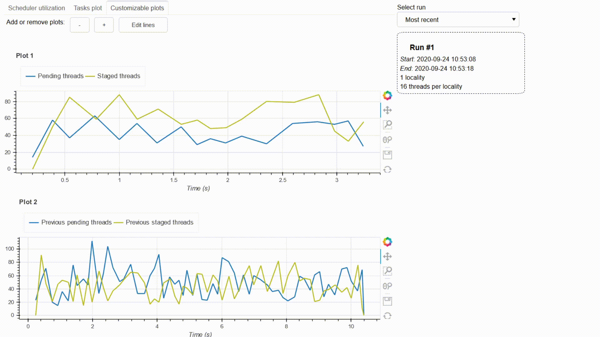
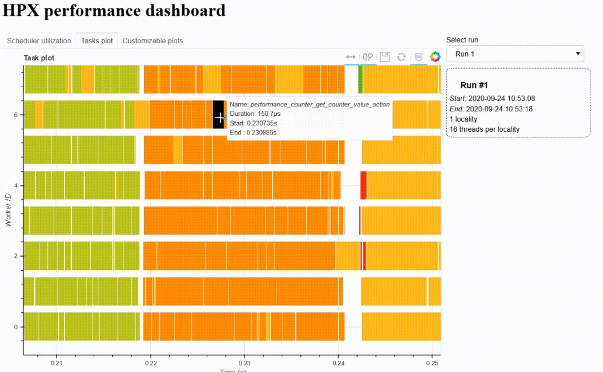
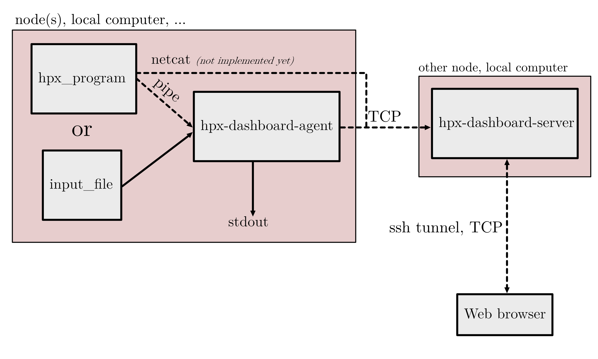

=================
HPX dashboard
=================

This document will guide you through the basic steps to get started with the HPX dashboard.

    

------------
Installation
------------

As the dashboard is almost entirely built with Python, installation can be done through the usual
``pip install``. It is recommended to create a virtual environnement:

.. code:: bash

    python -m venv path_for_the_venv
    source path_for_the_venv
    pip install --upgrade wheel

or if you use anaconda, you can create the environnement as follows:

.. code:: bash

    conda create --name myenv python=3.8

Once the environnement is created, clone the repository:

.. code:: bash

    git clone https://github.com/jokteur/hpx-dashboard

For regular users, installation can be done with the command:

.. code:: bash

    cd hpx-dashboard
    pip install .

For developpers, it is recommended to install with the source in place:

.. code:: bash

    cd hpx-dashboard
    pip install -e .
    
    # Install pre-commit and Sphinx additionnaly
    pip install -r ./requirements-dev.txt
    # Install the hooks for git
    pre-commit install

Once the hpx-dashboard is installed, make sure that it works by testing the command:

.. code:: bash

    hpx-dashboard-server

If after a few seconds, it shows

.. code:: bash

    INFO:hpx-dashboard:Bokeh server started on http://localhost:5006

Then it means that the installation has been successful.^

^^^^^^^^^^^^^^^^^^^^^^^^^^^^
Installation on CSCS - Daint
^^^^^^^^^^^^^^^^^^^^^^^^^^^^
If you are a user of the supercomputer Piz Daint of the CSCS, then the installation procedure is a
little bit different. To create the virtual environnement:

.. code:: bash

    # Load the python module if it is not already loaded
    module load cray-python
    python -m venv path_for_the_venv
    # It may that the wrong packages (from system packages) will load once the program is running
    # Before activating the environnement, you can unset the python path
    unset PYTHONPATH
    # Then activate the environnement
    source ./path_for_the_venv/bin/activate

Then the rest of the installation should be similar as described above.

------------
Introduction
------------

^^^^^^^^^^^^^
What is HPX ?
^^^^^^^^^^^^^

HPX is an open-source C++ standard library for Concurrency and Parallelism which closely follows 
the C++11/14/17/20 ISO standard. The goal of HPX is to provide an open source implementation of a
`new programming model <https://hpx-docs.stellar-group.org/latest/html/why_hpx.html#parallex-a-new-execution-model-for-future-architectures>`_
which allows to fully take advantage of parallel systems, from low power devices to large scale 
clusters. This means that the libary allows for task-based programming: the user can spawn millions
of threads (i.e. tasks) with minimal overhead.

To learn more about HPX, visit the `official documentation <https://hpx-docs.stellar-group.org/latest/html/index.html>`_ or the `official github <https://github.com/STEllAR-GROUP/hpx>`_.

^^^^^^^^^^^^^
The dashboard
^^^^^^^^^^^^^

The goal of the HPX dashboard is to provide an open-source interactive dashboard for debugging and 
performance analysis of HPX applications. The tool is build with Python and `Bokeh <https://bokeh.org/>`_
, which allows for interactive plotting. Here are the goals of the project:

* It should be an external tool that does not add overhead on the HPX application. This is why data produced by HPX can be streamed over the network to the plotting server of the dashboard.
* The tool should be in real-time. Indeed, HPX has a capability of producing real-time data (with the `performance counters <https://hpx-docs.stellar-group.org/latest/html/manual/optimizing_hpx_applications.html#performance-counters>`_). This allows for the user to have a quick feedback on the performance of his app. 
* Integration with Jupyter notebooks. With the notebooks, the user explore the data that is collected by the dashboard and also extend it.
* A tool that is also build for the demonstration of HPX applications in tutorials and courses.

This tool is *not* intended to replace more advanced profiling tools such as vampire. Also, due to
current limitations with Python and rendering, this tool cannot process extremely large datasets
which typically result from very long executions of HPX applications.

^^^^^
Usage
^^^^^

The hpx dashboard is divided into two separate command lines: ``hpx-dashboard-agent`` and 
``hpx-dashboard-server``. The role of the agent is to collect the data and parse it. With
the agent, you can filter out hpx data from the standard output and redirect non hpx data to a 
file or to the console. The agent connects to the server (also called the plotting server), and
sends data to it through TCP. The server will collect and organise the incoming data. Finally, the
user connects to the plotting server through the web-browser. It is also possible to do the plotting
directly on a jupyter notebook (see documentation).

First start the server with

.. code:: bash

    hpx-dashboard-server

, you can then connect with the browser to ``localhost:5006`` and interact with the widgets.

Then launch the hpx program with a performance counter (example program):

.. code:: bash

    1d_stencil_4 --hpx:print-counter=/scheduler/* --hpx:print-counter=/threads/* | hpx-dashboard-agent

which will automatically send the data to the server.

^^^^^^^^^^^^^^^^^^^^^^^^^^
Building the documentation
^^^^^^^^^^^^^^^^^^^^^^^^^^

For building the documentation, `Sphinx <https://www.sphinx-doc.org/en/master/index.html>`_ needs
to be installed on the environment. It is necessary that the dashboard is also installed as a package
in the same environment for the source code generation.

Install sphinx and the rtd theme:

.. code:: bash

    pip install sphinx sphinx-rtd-theme

And then build the doc:

.. code:: bash

    cd docs
    make html
    