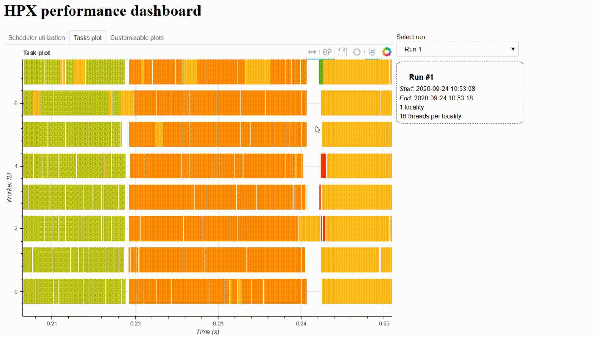

.. HPX dashboard documentation master file, created by
   sphinx-quickstart on Wed Sep  9 12:04:33 2020.
   You can adapt this file completely to your liking, but it should at least
   contain the root `toctree` directive.

Welcome to HPX dashboard's documentation!
=========================================

.. image:: _static/images/demo1.gif
    :width: 45%
    :align: left
    

.. toctree::
   :maxdepth: 2
   :caption: Contents:

   quickstart
   dashboard
   jupyter
   _source/modules

Indices and tables
==================

* :ref:`genindex`
* :ref:`modindex`
* :ref:`search`
